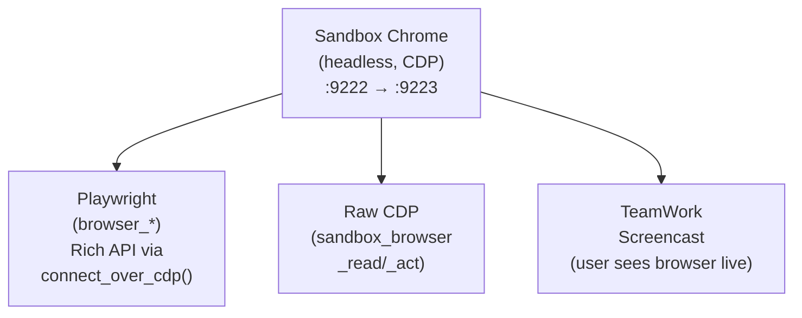
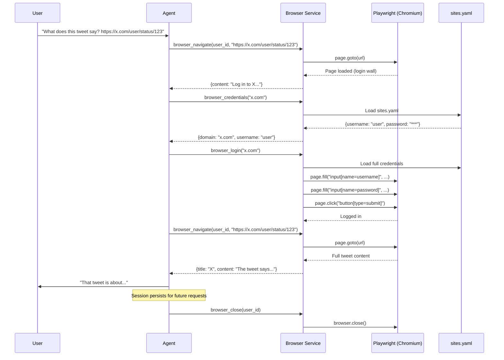
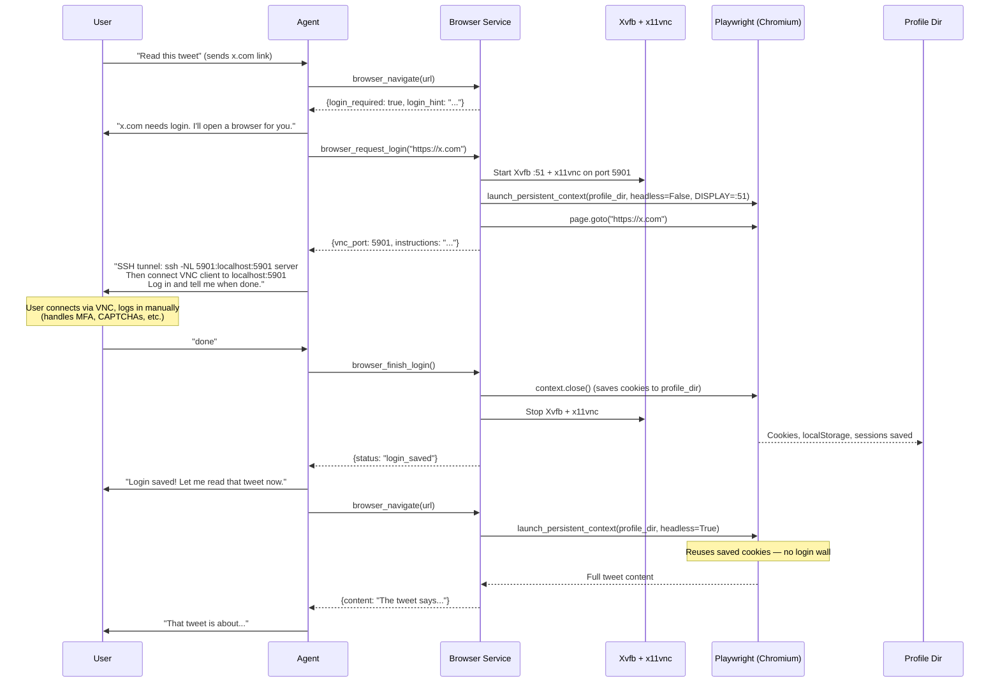

# Browser Automation

[← prax-sandbox docs](README.md)

> Part of **prax-sandbox**: the headless Chrome + CDP the sandbox provides. The
> harness-side browser integration (Playwright connection, the browser spoke,
> local-chromium fallback) lives in the consuming harness (e.g. Prax).

### Why a Live Browser?

Many websites (Twitter/X, SPAs, pages behind logins) return empty or broken HTML to a simple `requests.get()`.  Modern pages render content with JavaScript, gate it behind authentication, or use anti-bot protections.  Prax needs a **real browser** — one that executes JS, stores cookies, and renders the DOM — to interact with the web the way a human does.

### Architecture: One Chrome, Two APIs

In Docker, the sandbox container runs a **headless Chromium** with remote debugging enabled (CDP on port 9222, forwarded to 9223 via socat).  **Three consumers share the same Chrome instance:**



- **Playwright** connects via `connect_over_cdp()` — the agent gets ergonomic selectors, auto-waiting, form filling, and file uploads, all operating on the shared Chrome
- **Raw CDP** (`cdp_service.py`) — low-level WebSocket protocol for direct DOM evaluation, input dispatch, and screenshots; used by `sandbox_browser_read`/`sandbox_browser_act` tools
- **TeamWork** — streams the Chrome screencast to the web UI so the user watches in real-time and can "Take Over" control

When the user takes over (e.g. to solve a CAPTCHA), the agent sees the resulting page state immediately because it's the same browser.

### Playwright vs Raw CDP

Both APIs talk to the same Chrome instance.  Playwright wraps CDP with a high-level, reliable API; raw CDP gives direct protocol access when needed.

| Capability | Playwright | Raw CDP |
|------------|-----------|---------|
| **Selectors** | `click("text=Sign In")`, CSS, XPath, role-based | You compute coordinates yourself |
| **Waiting** | Auto-waits for elements, navigation, network idle | Manual — you poll DOM or listen for events |
| **Forms** | `fill()`, `select_option()`, `check()` — handles focus, clear, type | `Input.dispatchKeyEvent` one keystroke at a time |
| **Navigation** | `goto()`, `wait_for_url()`, `go_back()` — handles redirects | `Page.navigate` + manual lifecycle tracking |
| **Screenshots** | One-liner | One-liner (equally good) |
| **File uploads** | `set_input_files()` | `DOM.setFileInputFiles` (painful) |
| **iframes** | `frame_locator()` traverses naturally | Manual frame tree management |
| **Multi-tab** | Built-in page management | Manual `Target.createTarget` |
| **Error messages** | `"Timeout waiting for selector 'button.submit'"` | `"Target closed"` or cryptic protocol errors |
| **Stealth** | Anti-bot patches available (playwright-stealth) | You're on your own |
| **Network interception** | `route()` for interception, but abstracted | Full access — `Network.getResponseBody`, `Fetch.fulfillRequest` |
| **Performance profiling** | No | Full access — `Profiler`, `HeapProfiler`, `Tracing` |
| **Console/JS eval** | `evaluate()` works fine | Direct `Runtime.evaluate` — equivalent |

**In practice:** Prax uses Playwright for most browser tasks (navigation, login flows, form filling, content extraction).  Raw CDP is available for edge cases that need low-level protocol access (performance profiling, network interception, direct input dispatch).

### Authentic Browser Presentation

Prax uses **Patchright** (a patched fork of Playwright) so the shared Chrome session presents itself as a standard browser — not as automation tooling. This is appropriate because Prax's browser is a **human/AI collaborative session**: a real person pairs with the agent to browse the web together, with the user able to take over at any time (e.g. to solve CAPTCHAs or complete MFA).

What Patchright changes vs stock Playwright:
- Removes `Runtime.enable` CDP command that anti-bot scripts detect
- Sets `navigator.webdriver = false` (removes `--enable-automation` flag)
- Uses `--disable-blink-features=AutomationControlled` to suppress automation markers

The sandbox Chrome also launches with `--disable-blink-features=AutomationControlled` so the same presentation applies whether Playwright connects via CDP or the user views the screencast.

### Thread Safety & Spoke Agents

Playwright's sync API binds page/context objects to the thread that created them. This matters because `delegate_parallel` runs spoke agents in a `ThreadPoolExecutor` — the browser spoke may execute in a different thread than the one that originally created the Playwright session.

**Solution:** `browser_service.py` uses `threading.local()` for per-thread session storage. Each thread gets its own Playwright CDP connection to the same sandbox Chrome. This is cheap (just a WebSocket) and avoids cross-thread violations.

Additionally, `delegate_parallel` copies the parent thread's `ContextVars` (user ID, channel ID, active view) to worker threads via `contextvars.copy_context()`, ensuring browser tools can resolve the correct user session.

### OAuth Popups (Google Sign-In, etc.)

Google Sign-In and similar OAuth flows use `window.open()` to spawn a popup. The sandbox Chrome launches with `--disable-popup-blocking` and `--disable-features=BlockThirdPartyCookies` to allow these flows.

On the Playwright side, `BrowserSession` registers a `context.on("page", ...)` listener that auto-switches the active page reference to the popup when it opens, and switches back when the popup closes. TeamWork's tab watcher (polling `/json` every 2 seconds) also detects new tabs and reconnects the screencast to the popup so the user can see and interact with the OAuth flow.

### Configuration

```bash
# docker-compose sets this automatically:
BROWSER_CDP_URL=http://sandbox:9223   # Playwright connects to sandbox Chrome

# Local dev (no sandbox) — leave unset and Playwright launches its own browser:
#BROWSER_CDP_URL=
```

When `BROWSER_CDP_URL` is set, Playwright calls `connect_over_cdp()` to attach to the existing Chrome.  If the connection fails (sandbox not running), it falls back to launching a standalone browser — so local development works without Docker.

### Login Strategies

The agent gets a full Playwright-backed Chromium browser with per-user sessions. Two login strategies:

1. **YAML credentials** (`sites.yaml`) — the agent fills login forms automatically
2. **VNC manual login** — the agent starts a visible browser on a VNC display; the user SSH-tunnels in, logs in manually (handling MFA, CAPTCHAs, etc.), and the login session is saved to a **persistent browser profile** that future headless sessions reuse

When a user texts a Twitter link, the agent opens it, detects the login wall, and either auto-fills credentials or prompts the user to connect via VNC.

### Browser Automation Flow



### VNC Manual Login Flow



### Persistent Browser Profiles

When `BROWSER_PROFILE_DIR` is set, the browser uses Playwright's persistent context to save cookies, localStorage, and session data to disk. This means:

- Logins survive process restarts
- Each user gets an isolated profile at `{BROWSER_PROFILE_DIR}/{phone_number}/`
- VNC logins and YAML credential logins both persist to the same profile
- The agent can check login status before attempting access (`browser_check_login`)

```bash
# Enable persistent profiles
echo 'BROWSER_PROFILE_DIR=./browser_profiles' >> .env

# Enable VNC for manual login (requires Xvfb + x11vnc on the server)
echo 'BROWSER_VNC_ENABLED=true' >> .env
echo 'BROWSER_VNC_BASE_PORT=5900' >> .env

# Install VNC dependencies (Linux)
sudo apt-get install xvfb x11vnc
```

### sites.yaml Credentials Format

Store site credentials in a YAML file (set `SITES_CREDENTIALS_PATH` in `.env`):

```yaml
sites:
  x.com:
    username: your_twitter_handle
    password: your_password
    aliases:
      - twitter.com

  github.com:
    username: your_github_user
    password: your_github_pat

  reddit.com:
    username: your_reddit_user
    password: your_reddit_pass
```

The `aliases` field lets the agent match `twitter.com` URLs to `x.com` credentials. The `browser_credentials` tool returns the username but hides the password; `browser_login` exposes the password only to the Playwright fill action.

### Browser Tools

**Playwright tools** (high-level, recommended for most tasks):

| Tool | What It Does |
|------|-------------|
| `browser_navigate` | Navigate to a URL, wait for JS to render, return page text (detects login walls) |
| `browser_read_page` | Get the current page's text content |
| `browser_screenshot` | Take a PNG screenshot of the current page |
| `browser_click` | Click an element by CSS selector |
| `browser_fill` | Fill a form field |
| `browser_press` | Press a keyboard key (Enter, Tab, Escape) |
| `browser_find` | Query all elements matching a selector |
| `browser_credentials` | Look up stored credentials (password hidden) |
| `browser_login` | Fill login form with stored credentials |
| `browser_close` | Close the browser session |
| `browser_request_login` | Start VNC session for manual login (MFA, CAPTCHAs) |
| `browser_finish_login` | End VNC session and save persistent profile |
| `browser_check_login` | Check if currently logged into a domain |
| `browser_profiles` | List all saved browser profiles |

**Raw CDP tools** (low-level, for direct Chrome DevTools Protocol access):

| Tool | What It Does |
|------|-------------|
| `sandbox_browser_read` | Read from sandbox Chrome — text, URL, screenshot, scroll (user sees actions live in TeamWork) |
| `sandbox_browser_act` | Act in sandbox Chrome — navigate, click (by text or CSS), type, press keys (user watches live) |
